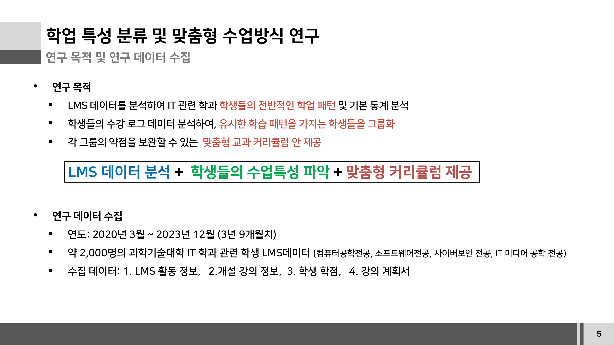
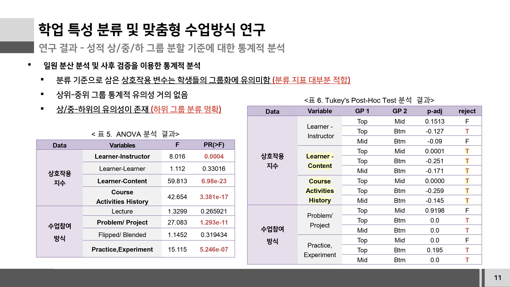
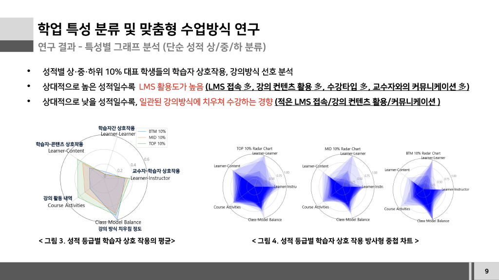
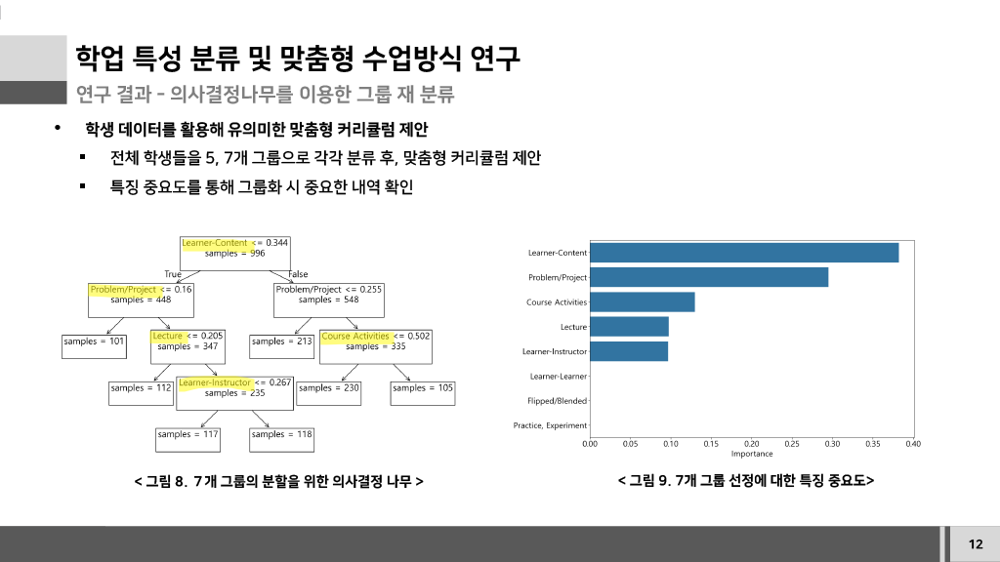

<div align="center">

# LMS 데이터 기반 학생 특성 분석 및 맞춤형 커리큘럼 추천


🏆 대학혁신지원사업 우수 연구 사례

**학생 학습 행동 분석 · 통계적 검증 · 학생 그룹 분류 · 커리큘럼 제안**

<p>
  
  
  
  
  
</p>


<sub>🔐 실제 학생 데이터와 원본 연구 데이터는 개인정보 및 연구 데이터 보호를 위해 공개하지 않습니다.<br>
공개 가능한 범위에서 연구 목적, 데이터 구성, 분석 방법 및 주요 결과를 정리했습니다.</sub>

</div>

---

## 프로젝트 개요

LMS에 축적된 학생들의 학습 활동 데이터를 분석하여 **학생별 학업 특성을 파악하고, 유사한 학습 패턴을 가진 학생들을 그룹화한 뒤 각 그룹에 맞는 맞춤형 커리큘럼을 제안**한 연구 프로젝트입니다.

연구에서는 IT 관련 학과 학생의 LMS 활동 정보, 개설 강의 정보, 학생 학점, 강의계획서 데이터를 활용했습니다.

원천 데이터는 약 **2,000명 규모**였으며, 데이터 정제 및 정규화 이후 **1,106명의 학생 데이터**를 분석에 활용했습니다.

> **LMS 데이터 → 특성 설계 → 통계적 검증 → 학생 그룹 분류 → 맞춤형 커리큘럼 제안**

🌟[Google Drive에서 파일 보기](https://drive.google.com/file/d/1nWrJxq5zTOr5qil-ACfM6eRlQyD2S_DE/view?usp=sharing)

---

<div align="center">

## 주요 결과

| 📊 학습 특성 분석 | 🧪 통계적 검증 |
|---|---|
| LMS 상호작용과 강의 방식별 학습 패턴 분석 | ANOVA + Tukey HSD를 통한 그룹 차이 검증 |

| 🌳 학생 프로파일링 | 🎓 커리큘럼 제안 |
|---|---|
| Decision Tree 기반 학생 그룹 분류 | 그룹별 특성에 따른 맞춤형 학습 지원 방향 제안 |

</div>

### LMS 활용 패턴



### 통계적 검증



### 학생 프로파일링





### 커리큘럼 제안


---

## 분석 흐름

```text
LMS / Course / Grade / Syllabus Data
                │
                ▼
      Data Cleaning & Normalization
                │
                ▼
      Interaction Feature Engineering
                │
                ▼
       Exploratory Data Analysis
                │
                ▼
          ANOVA + Tukey HSD
                │
                ▼
        Decision Tree Modeling
                │
                ▼
       Student Group Profiling
                │
                ▼
    Personalized Curriculum Proposal
```

---

## 상세 문서

[연구 방법 →](docs/methodology.md)  
연구 배경, 데이터 구성, 데이터 정제 및 특성 설계

[통계 분석 →](docs/statistical-analysis.md)  
ANOVA, Tukey HSD 및 통계적 검증 결과

[학생 프로파일링 →](docs/student-profiling.md)  
Decision Tree, 그룹 분류, 특징 중요도 분석

[커리큘럼 추천 →](docs/curriculum-recommendation.md)  
5개/7개 그룹별 특성과 맞춤형 커리큘럼 제안

