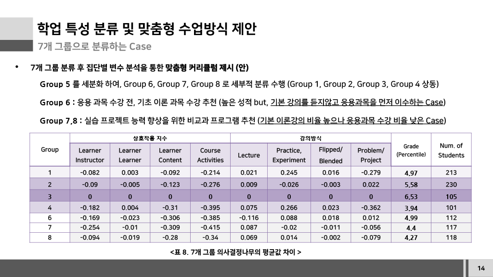

# Curriculum Recommendation

## 1. 5개 그룹 기반 추천

| Group | 주요 특성 | 커리큘럼 제안 |
|---|---|---|
| Group 1 | LMS 활동은 높지만 성적이 낮음 | Problem / Project 기반 수업 및 역량 향상 프로그램 |
| Group 2 | 성적이 높고 상위권 도약 가능성이 있는 그룹 | 프로그래밍·프로젝트 역량 향상 |
| Group 3 | 최상위권 학생 그룹 | 인턴십·교외 활동 등 대외 활동 |
| Group 4 | 특징이 뚜렷하지 않거나 성적이 낮음 | 기초과목 중심 재학습 및 Catch-up |
| Group 5 | 특징이 뚜렷하지 않거나 성적이 낮음 | 기초과목 중심 재학습 및 추가 분석 |

## 2. 7개 그룹 기반 세분화

### 기초 이론 선이수가 필요한 그룹

응용 과목을 먼저 수강하는 학생에게 기초 이론 과목을 먼저 이수하도록 제안했습니다.

### 실습·프로젝트 역량 강화가 필요한 그룹

기본 이론 강의 비율은 높지만 응용 과목 수강 비율이 낮은 학생에게 실습·프로젝트 관련 비교과 프로그램을 제안했습니다.

## 3. 해석

추천 결과는 학생을 단순한 성적 수준으로만 분류하는 것이 아니라 학습 상호작용, 강의 방식, 학점 등의 특성을 함께 고려하여 그룹별 지원 방향을 제시하는 방식으로 구성했습니다.

## 4. 한계

실제 커리큘럼 적용 후 효과 검증이 수행되지 않았으므로, 후행 평가를 통한 추천 효과 검증이 필요합니다.
