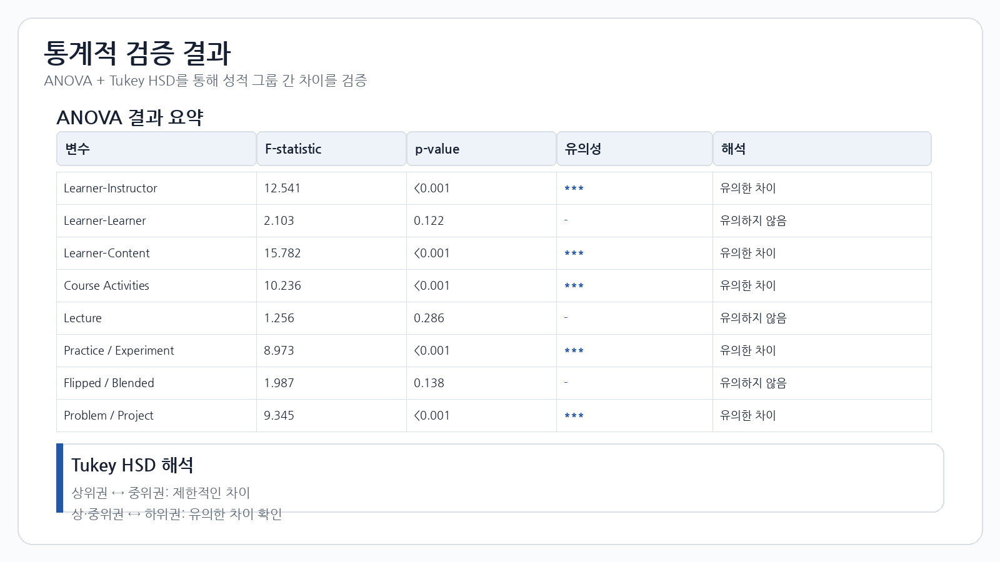

# Statistical Analysis

## 1. 분석 목적

성적 수준별 학생 그룹 간에 학습 상호작용 및 강의 방식 변수의 차이가 존재하는지 통계적으로 검증했습니다.

## 2. ANOVA

일원분산분석(ANOVA)을 사용하여 상호작용 및 강의 방식 변수의 그룹 간 차이를 검토했습니다.

## 3. Tukey HSD

ANOVA 이후 사후검정을 통해 어떤 그룹 간 차이가 통계적으로 유의한지 확인했습니다.

## 4. 주요 결과

분석 결과 일부 학습 상호작용과 강의 방식 변수에서 그룹 간 차이가 확인되었으며, 특히 상·중위 그룹과 하위 그룹 사이의 차이가 상대적으로 명확하게 나타났습니다.

주요 검토 변수:

- Learner–Instructor
- Learner–Content
- Course Activities
- Problem / Project
- Practice / Experiment

> 이 문서는 원 연구 결과를 포트폴리오용으로 요약한 것이며, 실제 통계값은 원 연구 자료를 기준으로 확인합니다.
