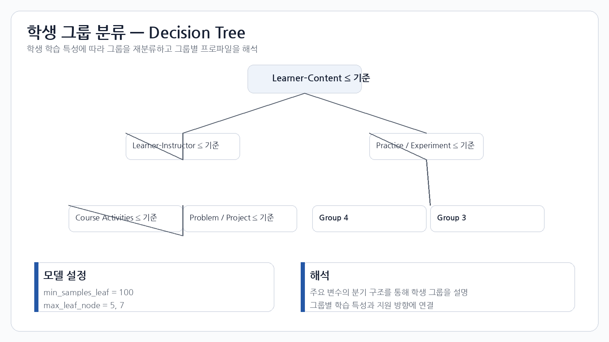
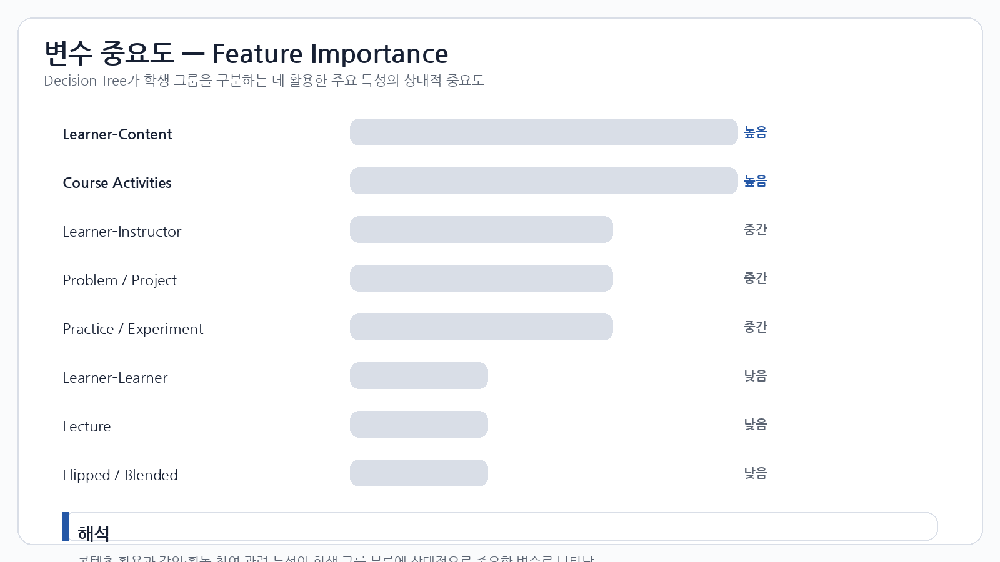

# Student Profiling

## 1. Decision Tree

통계적 분석을 통해 확인한 학생 특성과 학점 정보를 활용하여 학생 그룹을 재분류하고 그룹별 특징을 해석했습니다.



## 2. 모델 설정

해석력 강화를 위해 다음과 같은 제약을 적용했습니다.

```text
min_samples_leaf = 100
max_leaf_node = 5, 7
```

## 3. Feature Importance

의사결정나무의 분기 구조와 특징 중요도를 통해 학생 그룹 분류에 중요한 학습 특성을 확인했습니다.



## 4. 그룹 프로파일링

### 5개 그룹

학생들을 5개 그룹으로 분류하고 각 그룹의 학습 특성과 학점 수준을 비교했습니다.

### 7개 그룹

추가적인 세분화가 필요한 집단을 다시 분류하여 보다 구체적인 학습 지원 방향을 제안했습니다.
